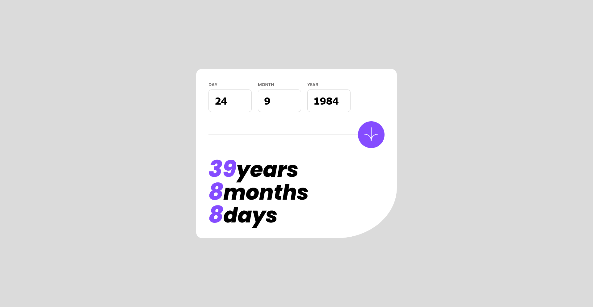

# Frontend Mentor - Age calculator app solution

This is a solution to the [Age calculator app challenge on Frontend Mentor](https://www.frontendmentor.io/challenges/age-calculator-app-dF9DFFpj-Q). Frontend Mentor challenges help you improve your coding skills by building realistic projects. 

## Table of contents

- [Overview](#overview)
  - [The challenge](#the-challenge)
  - [Screenshot](#screenshot)
  - [Links](#links)
- [My process](#my-process)
  - [Built with](#built-with)
  - [Continued development](#continued-development)
  - [Useful resources](#useful-resources)
- [Author](#author)
- [Acknowledgments](#acknowledgments)

## Overview

### The challenge

Users should be able to:

- View an age in years, months, and days after submitting a valid date through the form
- Receive validation errors if:
  - Any field is empty when the form is submitted
- Auto corrects input if: 
  - If the value of the month exceeded the maximum number of days eg. 31/04/1991 will auto correct to 30/04/1991
  - If the year is greater than the current year, it automatically sets to the current year
  - If the year is the current year, months and dates are configured in a way that it doesn't go beyond today
- View the optimal layout for the interface depending on their device's screen size
- See hover and focus states for all interactive elements on the page

### Screenshot

### Links

- Live Site URL: [Github](https://justinjovert.github.io/Age-calculator-app)

## My process

- Writing the JavaScript was where I had trouble, since I made my own way of tackling the feedback. By utilizing the Date method, I set the event listeners such that if the user inputs future dates, i.e 2025, it inputs the current year, 2024. And that it cannot go beyond to what is the current date.

- I also made use of arrays with the number of days a month has as elements, made it easy to index the months for days and to input between 1 and the maximum number of days of the month.
 

### Built with

- Semantic HTML5 markup
- CSS custom properties
- Flexbox
- JavaScript

### Continued development

- I wrote this code in such a way that I kept following error for error, added conditions for when a problem arises.
- I am confident that this code has the potential to be more compact and concise. 

### Useful resources

- [Asaeneh's 30 Day of JavaScript](https://github.com/Asabeneh/30-Days-Of-JavaScript)

## Author

- [Github](https://github.com/Justinjovert/)
- Frontend Mentor - [Justinjovert](https://www.frontendmentor.io/profile/Justinjovert)

## Acknowledgments

Frontend Mentor and Asabeneh Yetayeh.